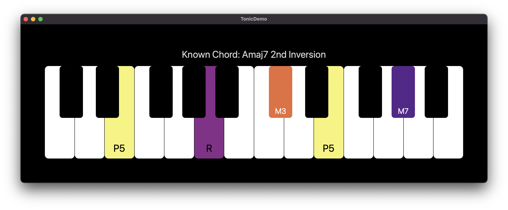

# Tonic

Swift library for music theory, currently focused on chords/harmony.

Tonic answers musical questions, such as:

- What's the note for this pitch in this key? 

    `Note(pitch: Pitch(midiNoteNumber), key: .Bb)`

- What's the name of a chord? 

    `Chord(notes: notes).description`

- What chords are in this key? 

    `Key.Cm.chords`

- What chords in this key contain this note? 

    `Key.C.chords.filter { $0.noteClasses.contains(.C) }`

- What notes do these keys have in common?  

    `Key.C.noteSet.intersection(Key.Cm.noteSet)`

- What notes don't these keys have in common? 

    `Key.C.noteSet.symmetricDifference(Key.Cm.noteSet)`

These questions are all tested in our unit tests explicitly.

## Goals

- **Correctness**. Try to be as correct with respect to music theory as possible.
- **Strong typing**. Use types to prevent errors (e.g. `Pitch` instead of `UInt8`).
- **Good performance**. Tonic uses bit sets to represent pitch sets and note sets.

## Documentation

The documentation is host on the [AudioKit.io Website](https://www.audiokit.io/Tonic/). The package includes a demo project as well.

## Install

Install using Swift Package Manager.
